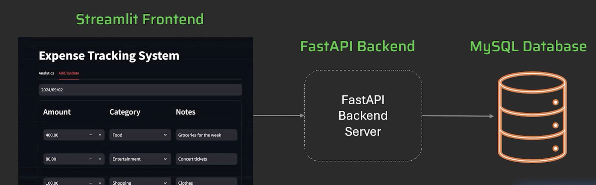
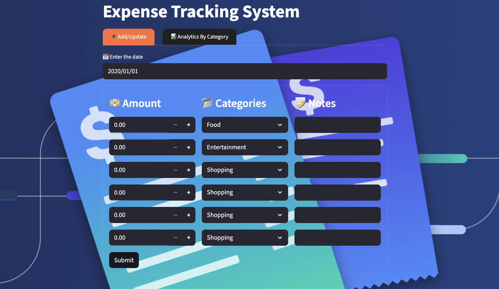
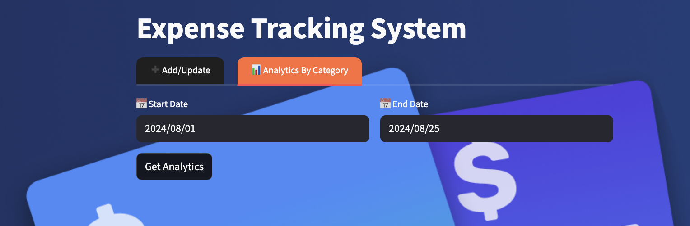
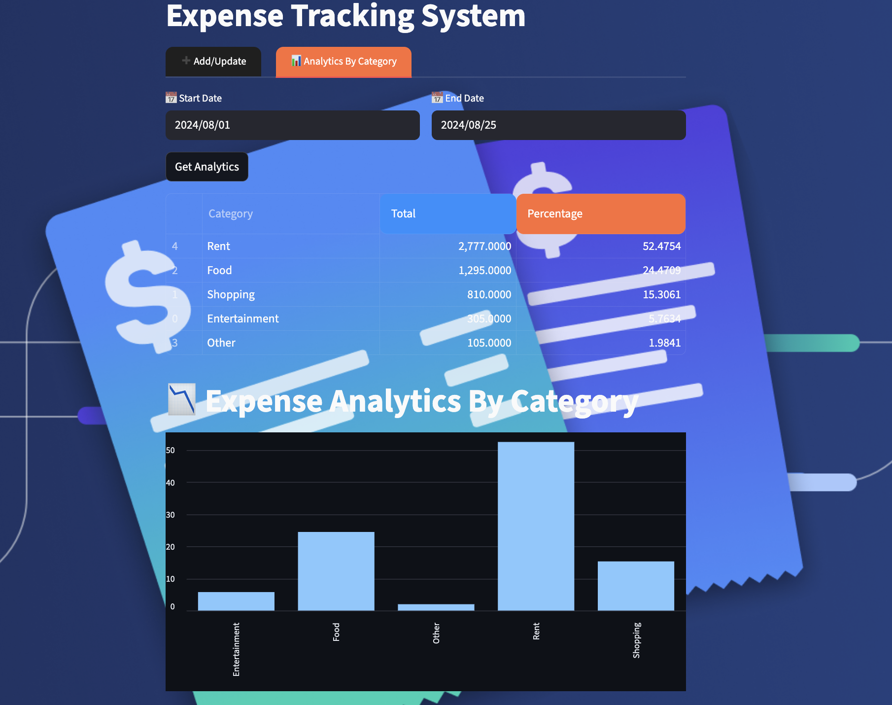

# Expense Tracking System

The Expense Tracking System is a full-stack application designed to help users easily track, organize, and analyze their daily expenses.
- **Frontend**: Built with Streamlit for a clean and interactive user interface.
- **Backend**: Powered by FastAPI to provide secure and high-performance REST APIs.
- **Database**: Uses MySQL to store categories, expenses, and analytics data.

## Problem Statement
#### Why this project is needed:
Managing personal expenses is often a challenging task, as individuals spend money across various categories such as rent, food, shopping, travel, and other daily needs. Without a systematic way to record and track spending, it becomes difficult to understand where the money goes, identify spending patterns, or make informed financial decisions.

Currently, many people rely on manual tracking methods such as writing in notebooks or maintaining spreadsheets, which can be tedious, error-prone, and lack meaningful insights. There is a clear need for a simple yet effective solution that enables users to record, organize, and analyze their expenses conveniently.

#### What problem it solves for users:
This project eliminates the hassle of manual expense tracking by providing a web-based system where users can:
- Record their expenses by date and category.
- View spending patterns over custom time ranges.
- Analyze expenses category-wise through an analytics dashboard.

By doing so, users gain clarity on where their money goes, can control overspending, and make better financial decisions.

## Key Features
- Add and update expenses by date, category, and notes
- View category-wise and date-wise expense history
- Analytics dashboard with summary and category distribution
- REST APIs tested with Postman before UI integration

This project is built step-by-step, starting with the backend (FastAPI + MySQL), tested via Postman, and finally integrated into a user-friendly Streamlit application.

## Flow Diagram


## Project Structure

- **frontend/**: Contains the Streamlit application code.
- **backend/**: Contains the FastAPI backend server code.
- **tests/**: Contains the test cases for both frontend and backend.
- **requirements.txt**: Lists the required Python packages.
- **README.md**: Provides an overview and instructions for the project.


## 🛠 Tech Stack  
 
 
 
 
 
 
 
 


## Setup Instructions

1. **Clone the repository**:
   ```bash
   git clone https://github.com/yourusername/expense-management-system.git
   cd expense-management-system
   ```
2. **Install dependencies:**:   
   ```commandline
    pip install -r requirements.txt
   ```
3. **Run the FastAPI server:**:   
   ```commandline
    uvicorn server.server:app --reload
   ```
4. **Run the Streamlit app:**:   
   ```commandline
    streamlit run frontend/app.py
   ```
## Usage
#### Add/Update Expenses
Users can add or update their daily expenses using the **Add/Update** tab.
- Select the date of the expense.
- Enter the amount, choose a category (e.g., Rent, Food, Shopping), and add notes for better tracking.
- Multiple rows can be added for different expenses on the same date.
- Finally, click Submit to save the records.

**Example**



#### Analytics by Category

The Analytics By Category tab allows users to view expense breakdowns within a given date range.
- Enter the **Start Date** and **End Date**.
- Click **Get Analytics** to view insights.



The results are shown in 2 forms:

1. **Summary Table** - Displays each category, total expense, and percentage share.
2. **Bar Chart** - Provides a clear visual comparison of expenses by category.

